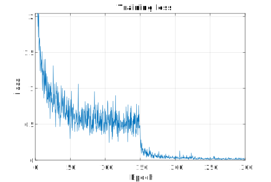

# tf.DenseNet
Tensorflow implementation of [DenseNet](http://arxiv.org/abs/1608.06993)

There are three objectives of this project
1. Mimic original Torch implementation
2. Implement similar interfaces of networks in __tf.contrib.slim.nets__
3. Use hihg-level API of Tensorflow

## Prerequisites
1. Python 3.6
2. Tensorflow rc1.10 or above
3. Numpy
4. CIFAR-10 or CIFAR-100 or ImageNet datasets

## Preparing dataset
### CIFAR-10 and CIFAR-100
Please download CIFAR-10 or CIFAR-100 datasets from [here](https://www.cs.toronto.edu/~kriz/cifar.html). Unzip the downloaded files and put the listed files below (these files do not have file extensions) in the working directory. Then, use _CIFAR_to_tfrecord.py_ to convert CIFAR datasets to _tfrecord_ files.
* CIFAR-10: data_batch1~data_batch5, and test_batch
* CIFAR_100: train and test
### ImageNet
Currently, N/A

## Training and evaluation
Use _CIFAR_trainval.py_ to train or evalulate the DenseNet architecture on CIFAR datasets. You can control following hyper-parameters.
* Number of epochs
* Batch size
* Depth, _L_
* Growth rate, _k_
* Nesterov momentum

## Experimental results
### Settings for CIFAR-10 and CIFAR-100
* DenseNet-BC with _L_=100 and _k_=12
* Normalization with avg. mean and std
* Augmentation (shifting and horizontal mirroring)
* 300 epochs (234,600 iterations) and batch size of 64
* 0.9 Nesterov momentum
* Learning rates: until 50%&rarr;0.1, until 75%&rarr;0.01, after 75%&rarr;0.001

### Results on CIFAR-10
Error rate: **4.98%**\

### Results on CIFAR-100
Error rate: **25.21%**\

### Settings for ImageNet
### Results on ImageNet
